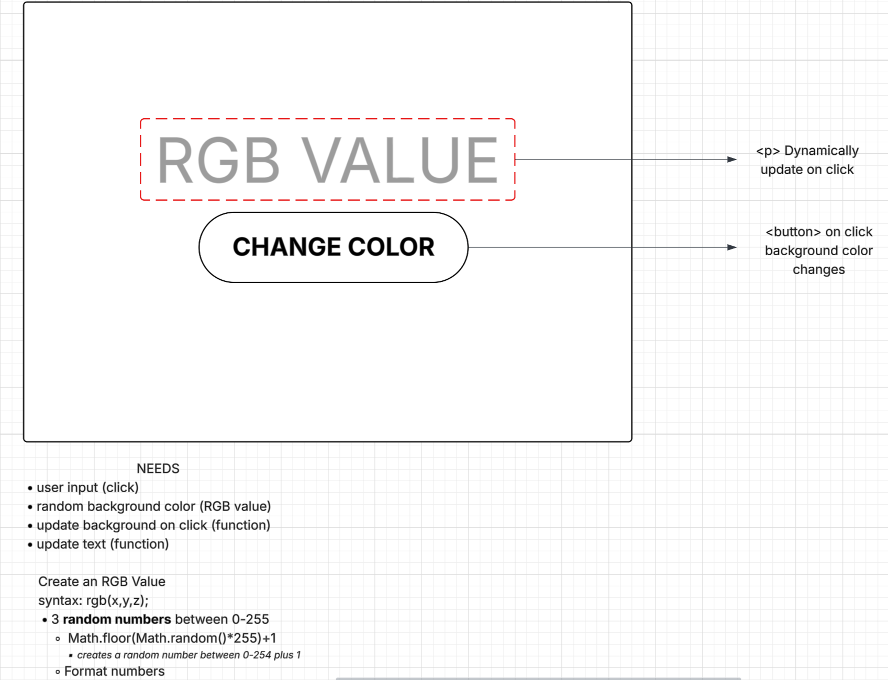

# Color Changer

### Summary
---
Today I take the leap. My first project is a bare bones color changer. With this project my goal is to push past the mental barrier and actually complete a project. Once that's done.. well here we are. *Today I commit.. **and actually push.*** 

### Tech Stack
---
- HTML
- CSS
- JavaScript
- Terminal
- VSCODE

## Planning
With each project I start on paper before opening VSCode. This helps me map out the project.

